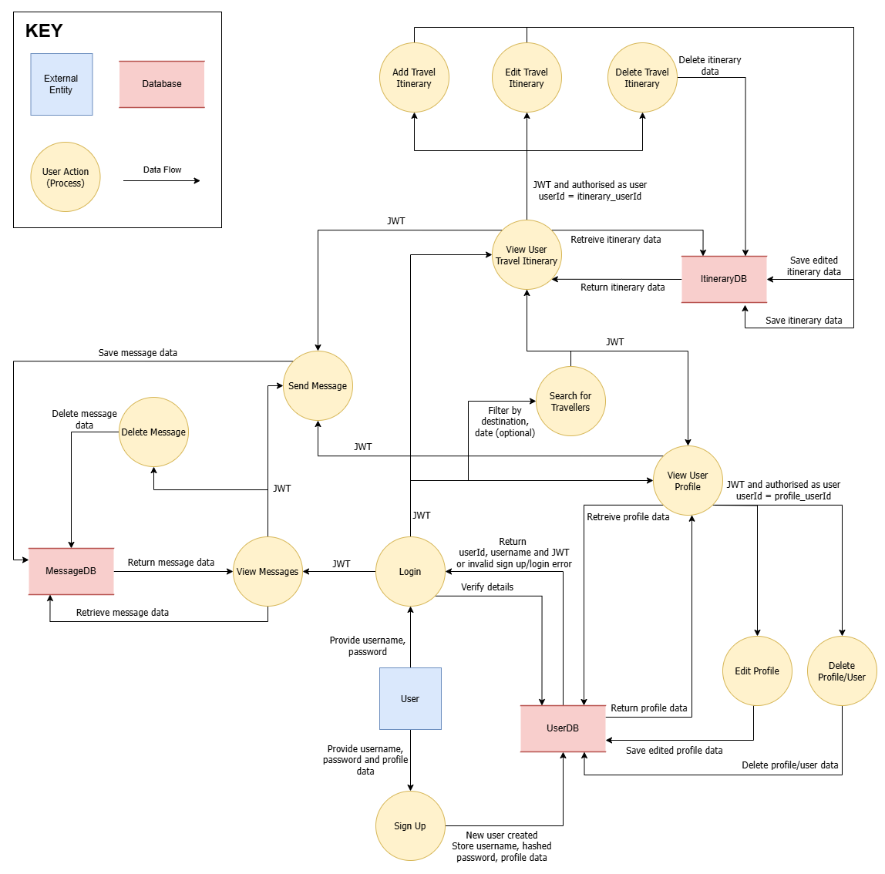

# T3A2: Full Stack App (Part A)

## MeetMyRoute

### Purpose

This application is designed to connect travelers with others who share similar travel interests or itineraries, whether they are fellow travelers or locals in their desination area. It aims to create a platform where travelers can find companionship, receive local insights, or even arrange meetups to enhance their travel experiences. By faciliating these connections, the app helps travelers feel more secure, get personalised travel tips, and enjoy shared experiences, especially those traveling alone.

### Functionality/Features

* User profiles:
    * Users create a profile where they share personal travel interests and bio information.
    * This profile is visible to others.
    * Users can set their profile status to either "Private", "Traveling", or "Local".

* Shared and private itinerary:
    * Users share upcoming travel plans by entering their destination(s) and travel dates.
    * Users add activities that are not shared publicly.

* Search and filtering:
    * Users can explore the community by searching for travelers with overlapping itineraries.
    * The app will have filters such as destination and date.

* Real-time chat and messaging:
    * A built-in chat feature allows users to connect and discuss plans, ask questions, or arrange meetups.

### Target Audience

The application is designed for all travelers but is particularly beneficial for solo travelers, who may seek companionship, security, or local guidance to enhance their journeys.

### Tech Stack

* Front-end
    * HTML
    * CSS
    * Javascript
    * React

* Back-end
    * Express
    * Node.js
    * Mongoose

* Database
    * MongoDB

* Deployment
    * Netlify - front-end
    * Render - back-end

* Project Management
    * Trello

* Diagramming
    * Draw.io

* Design
    * Figma

* DevOps
    * Visual Studio Code
    * Git
    * GitHub

### Competitor Research

We've identified two primary competitors in the travel companion space and took inpiration from: NomadHer and TripBFF.

* NomadHer
    * Target audience - female travelers.
    * Key features:
        * Community-focused - sharing stories and tips.
        * Social netowrking - connecting with like-minded individuals.
        * Travel buddy matching - finding companions with similar itineraries.

While we appreciated the community of NomadHer, we decided to make our app open to all travelers rather than focusing solely on one demographic. Additionally, although sharing stories and tips publicly is a valuable feature, we decided it was outside the scope of our project.

* TripBFF
    * Target audience - general travelers.
    * Key features:
        * Collaborative tip planning - creating and sharing itineraries.
        * Travel tips and advice - accessing expert insights.
        * Destination discovery - exploring new places.
        * Nearby traveler discovery - connecting with local travelers.
        * Travel tracking - monitoring progress and sharing experiences.
        * AI-powered trip planning - leveraging AI for personalised recommendations.

TripBFF, while it offers many features, one major differentiator is that TripBFF does not allow users to filter by travel dates, which our app will offer as a key advantage. This ability to search and filter by specific dates helps users find matches more precisely, making it easier to connect with others whose itineraries overlap.

In terms of design, both NomadHer and TripBFF feature light, clean interfaces with a dominant colour. We aim to maintain this minimalist approach in our app's design. While blue is a common choice for travel apps, symbolising trust and freedom, we opted for sunset orange to evoke warmth, excitement, and the thrill of exploration, aligning with the core values of our app.

### Dataflow Diagram


### User Stories 
--- 

  
**Jessica Turner**

**Role**: Photographer and Journalist  
**Location**: London, United Kingdom

**Background**: 
Jessica has spent over a decade as a photographer and journalist, using her lens and words to tell captivating stories from across the globe. Her deep love for photography and storytelling has inspired her to start a travel blog, where she plans to share her adventures and highlight the journeys of other travellers she meets along the way. Jessica's ultimate goal is to connect with fellow globetrotters and create a community of travellers who share their experiences, photos, and travel tips through her blog.

**Goals**: 
- Find like-minded travelers to interview and photograph for her blog. She seeks to build a network of travelers to connect with.
- Feature diverse voices in her blog by telling stories from people with varying travel itineraries. 
- Simplify her content creation process by quickly finding collaborators, getting their stories, and capturing unique images on the go. 

**Challenges**: 
- Difficulty in Connecting with Like-minded Travelers:  
  Jessica has a niche audience and often finds it challenging to connect with travelers whose journeys align with her unique itineraries.

- Managing Multiple Platforms:  
  Juggling various social media and travel platforms can be overwhelming. Jessica is looking for a more streamlined way to find the right people for her blog, without the hassle of using multiple platforms.

- Time Constraints:  
  With frequent travels, Jessica needs quick and efficient solutions to identify potential blog collaborators without investing too much time.

---
**Why MeetMyRoute**:  
- Familiar Interface:  
  Jessica downloaded MeetMyRoute because its interface reminded her of the dating apps she already uses, making it easy and familiar for her to navigate. 

- Simple Search & Discovery:  
  The app’s search functionality lets Jessica filter travelers by destination, travel dates, and interests, making it easier to find the perfect subjects for her blog and photography projects.

- Simplified Communication:  
  Meet My Route’s real-time messaging feature allows Jessica to arrange photography sessions and collaborate directly with travelers, eliminating the need for third-party communication tools.

--- 
  
**Josh Smith**

**Role**: University Student  
**Location**: Manchester, United Kingdom

**Background**: 
Josh has recently taken a gap year from university to explore the world before returning to his studies. This is his first time traveling internationally, and he’s eager to embrace new cultures and experiences. With enough savings to embark on a backpacking adventure, Josh plans to visit multiple countries throughout the year, looking for authentic experiences and opportunities to meet other travelers. His primary goal is to gain valuable insights into the cities and cultures he visits, learning from those who have traveled more extensively. He seeks to connect with more experienced travelers for advice, recommendations, and even potential travel companions.

**Goals**: 
- Connect with like-minded travelers to share experiences and travel advice, building a network of fellow backpackers along the way.
- Use a simple, intuitive app that makes it easy to find and connect with fellow travelers, without overwhelming features or complicated navigation.
- Find trustworthy travel companions for shared adventures and group activities, ensuring safety and mutual enjoyment.

**Challenges**: 
- Navigating New Destinations Without Local Knowledge:  
  Since Josh is new to traveling, he may struggle with finding local tips, hidden gems, or travel advice while in a new city. He wants to connect with experienced travellers who can share valuable recommendations and insights for exploring the area.

- Overwhelmed by Complex Apps:  
  Josh dislikes apps that are hard to navigate or have too many unnecessary features. He needs something easy to use without spending too much time figuring out how to operate it.

**Why MeetMyRoute**: 
- Recommended by a Friend:    
  Josh discovered the app through a recommendation from someone he met at a bike store. 

- User-Friendly Interface:   
  Josh can create a profile and plan his trip with MeetMyRoute’s simple, user-friendly layout, establishing his goals for the trip. The app allows him to easily connect with other travelers, without overwhelming him with complex features.

- Curated Itineraries with Like-Minded Travelers:  
  Josh finds other travellers who have similar hobbies and travel intentions thanks to MeetMyRoute. This makes it simple for him to find undiscovered treasures and distinctive experiences that suit his preferences.

--- 
## User Story 1: Profile Creation
```md 
As Jessica,
I want to create a profile on the platform,
So that I can establish myself as a blog writer and photographer, and attract potential collaborators.
```
**Acceptance Criteria**: 
- The profile creation form should gather basic information such name, location, travel preferences, and goals. 
- Users should be able to upload a profile picture.
- Validation should be included in the form to guarantee that all required fields are filled out.
- Users should be taken to their profile page to view and modify their information after submitting.

```md
As Josh,
I want to create a profile on the platform,
So that I can share my travel experiences, interests, and connect with travelers nearby. 
```
**Acceptance Criteria**: 
- For broader networking, users should be able to link their social media profiles on the form.
- Before submitting, users should be able to view their profiles on the system.
- The profile is active after submission, and the user may update their details at any time.

## User Story 2: Connecting with Other Travelers
```md
As Jessica,
I want to connect with other travelers who have similar itineraries,
So that I can collaborate with them for blog content and photography projects.
```
**Acceptance Criteria**: 
- Users should be able to search for travelers with overlapping itineraries using filters like destination and travel dates.
- The system should display traveler profiles that match the selected filters.

```md
As Josh,
I want to search for travelers who are heading to destinations I’m interested in,
So that I can join their adventures. 
``` 
**Acceptance Criteria**: 
- Users should be able to use a search bar to find travelers. 
- After searching for travelers, users should be able to view the profile status of each traveler (e.g., 'Travelling,' 'Local,' or 'Private') to understand who is currently traveling. 

## User Story 3: Messaging for Collaboration

```md
As Jessica,
I want to communicate directly with fellow travelers through the platform’s messaging feature,
So that I can arrange collaborations for interviews and photography sessions without needing third-party apps. 
```

```md
As Josh,
I want to communicate with other travelers directly through the platform,
So that I can discuss travel routes, find a travel buddy, and get recommendations for affordable places to stay.
```

**Acceptance Criteria**: 
- Users should be able to send files (documents, images, etc.) and view earlier chats.
- Users should be able to send direct messages through the platform, opening in a separate window for a cleaner interface.
- Notifications should be sent to users when they receive messages.

## User Story 4: Itinerary Management

```md
As Jessica,
I want to create and manage my travel itinerary on the platform,
So that I can plan my trips and connect with others who have similar travel goals.
```

**Acceptance Criteria**: 
- Users should be able to enter dates, travel destinations, and key activities for each trip using the app. 
- Itineraries should be customisable by adding or removing destinations, dates, and activities.

```md
As Josh,
I want to organise my trips in the itinerary feature,
So that I can easily keep track of my travel plans and control who can see them.
```

**Acceptance Criteria**: 
- Users should be able to update specific travel dates and times for planned destinations. 
- Users should be able to toggle between a detailed itinerary (dates, destinations, activities) and a simplified itinerary (dates, destinations), and share/view other's simplified itineraries.

### Revision and Refinement:

After engaging with users, we identified privacy concerns regarding the public sharing of detailed itinerary information. While users were open to sharing relevant details, they expressed the need for greater control over what components of their itinerary are visible to others.
Initially, we considered incorporating a toggle feature to allow users to switch between a detailed list and a simplified view of their itinerary for a more flexible experience. However, following user feedback, we recognised the importance of addressing concerns about sharing additional information, such as activities, publicly. This feedback reinforced the need to give users more discretion over the visibility of their itinerary details.

Based on this input, we have decided to implement the following:
- The simplified itinerary view, which includes only dates and destinations, will be publicly shareable.
- The detailed itinerary, containing more comprehensive information, will be private to the user. 

Users can securely share additional details, including accommodations, through direct messages, ensuring their privacy concerns are addressed. 


